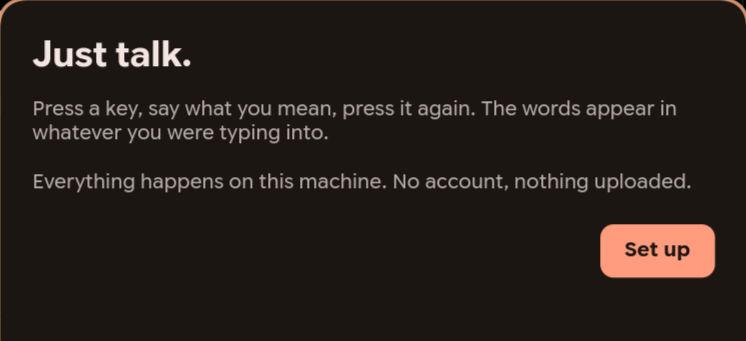
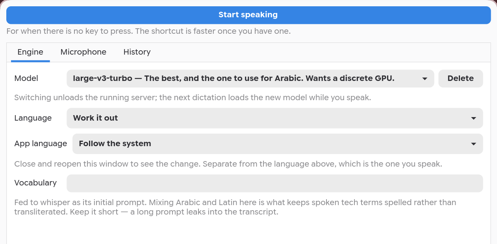
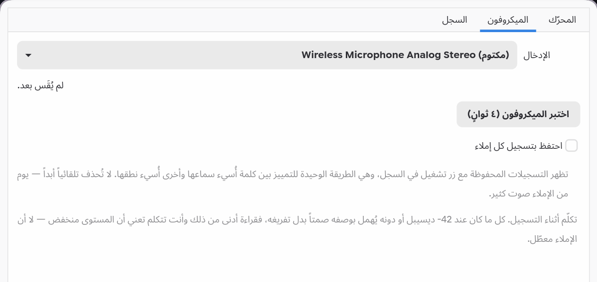

# Nabria

**Just talk.** Press a key, say what you mean, press it again. The words appear
in whatever you were typing into.

*نَبْرة — the tone of a voice.*

Everything happens on your machine. No account, no cloud, nothing uploaded, and
it works with the network off.

Arabic is first-class, including spoken dialect — that is what it was built
for, and it is the thing most dictation tools are worst at. English and the
other 90-odd languages Whisper knows work too. **The application itself is
written in both Arabic and English**, right-to-left included, and follows your
desktop's language unless you tell it otherwise.




## Install

Linux, Wayland. Take whichever line matches your system — each of them installs
the same thing, including the transcription engine.

**Fedora, and anything using `dnf`**

```sh
sudo dnf install https://github.com/M7MMAD-OMAR/nabria-app/releases/latest/download/nabria.rpm
```

**Debian, Ubuntu, and anything using `apt`**

```sh
wget https://github.com/M7MMAD-OMAR/nabria-app/releases/latest/download/nabria.deb && sudo apt install ./nabria.deb
```

**Arch** — [`nabria`](https://aur.archlinux.org/packages/nabria) in the AUR:

```sh
yay -S nabria
```

**Anything else**

```sh
curl -fsSL https://github.com/M7MMAD-OMAR/nabria-app/releases/latest/download/install-nabria.sh | sh
```

Then, whichever you used:

```sh
systemctl --user enable --now nabria
```

The first launch downloads the transcription model — a few hundred megabytes,
chosen to suit your hardware. That is the only download left after installing;
the engine itself is in the package.

If you already have a whisper model on the machine, setup finds it and offers
it, and there is a **Choose a file…** button for one kept somewhere else. A
model taken that way is linked rather than copied, so it costs no second copy
of the disk, and a recognised one is checked against its published checksum
exactly as a downloaded one is.

The packages are the better path if one exists for your system, because updates
then arrive the way every other update on your machine does — through `dnf
upgrade`, `apt upgrade`, or whatever your desktop already uses to tell you
there is something new. Nothing in Nabria phones home to check.

The `curl` line is [`scripts/bootstrap.sh`](scripts/bootstrap.sh), and you
should read anything that arrives down a pipe before running it: it fetches the
release tarball, unpacks it to `~/.local/share/nabria/app`, and runs the
installer from there. Re-run it to update. The same thing by hand:

```sh
git clone https://github.com/M7MMAD-OMAR/nabria-app.git
cd nabria-app
scripts/install.sh
```

The installer tells you what is missing in your own distribution's package
names, fetches the transcription engine, and downloads the model that suits
your hardware. Re-run it any time; it repairs rather than reinstalls.

The engine is a prebuilt binary — verified against a checksum committed to this
repository, not one served alongside the download, which would only prove the
bytes arrived intact. It needs glibc 2.34 or newer (Debian 12, Ubuntu 22.04,
RHEL 9 and anything later) and the Vulkan loader, and nothing else. Verified by
installing it on a clean Debian 12 with no compiler present.

If there is no prebuilt for your architecture, or it will not run on your
system, the installer says why and builds from source instead; that needs
`git`, `cmake` and a C++ compiler, and takes a few minutes once.

Then bind a key. Wayland gives no way for an application to claim a shortcut
for itself, so this part is yours — the installer prints the exact line for
your compositor. On Hyprland:

```
bind = CTRL ALT, Q, exec, nabria toggle
```

## Using it

```
nabria toggle      start and stop dictating
nabria cancel      throw the current take away
nabria settings    model, microphone, transcript history
nabria last        print the last transcript
nabria status      idle | recording | working
```

While you speak, a small pill sits under the middle of the screen with five
marks in it. They rise and fall with your voice, so a microphone that has gone
dead shows a flat row of dots rather than animating regardless. A wave moves
through them while it transcribes.

Nothing is lost. Every transcript is written to disk *before* it is typed. If
typing fails the text is on your clipboard and a notification says so. If
transcription fails the recording is kept, because the audio is the one thing
that cannot be produced again.

### On a tiling desktop

The setup window asks to be a fixed panel rather than a window — five steps,
nothing to resize, nothing to keep open. Hyprland honours that and floats it;
whether any other compositor does is its decision, not the application's. If
yours tiles it anyway:

```
# Hyprland
windowrule = float, title:^(Nabria)$
```
```
# sway
for_window [title="^Nabria$"] floating enable
```

The settings window is deliberately left alone, and the rules above do not
match it. It has a scrollable list of your transcripts, which is the one
place being resizable earns its keep.

`nabria settings` is where the model, the microphone and your transcripts
live — and, at the top of it, a button that takes a dictation. That is there
for the stretch before a key is bound: on GNOME and KDE the shortcut is a
settings dialog you have to find first, and until you have, this is the way
in. The key is faster once you have one.



**Two languages, not one setting.** *Language* is what you speak and is passed
to the engine. *App language* is what the windows are worded in. Dictating
Arabic on an English desktop is ordinary, and so is the reverse, so neither
follows the other.



More screenshots, both languages, in [docs/screenshots](docs/screenshots).
They are generated by `scripts/screenshots.py` from a profile created seconds
earlier, so they show what a new install looks like rather than a staged one.

## What it needs

**At least**

- Linux, on a Wayland session, `x86_64`
- PipeWire, and a microphone
- Python 3.10 or newer, GTK 4, PyGObject
- About 250 MB of disk: 55 MB of engine, and the smallest model
- No graphics card. It runs on the processor alone

**To run the largest model comfortably**

- A discrete graphics card with a Vulkan driver — any make
- Around 2 GB of free video memory
- 1.5 GiB of disk for the model itself

Every package listed under Install pulls the first group in for you.

## Which model

Three, chosen at setup from what the machine has. Download sizes are exact;
the memory column is [whisper.cpp](https://github.com/ggml-org/whisper.cpp)'s
own figure for the model in memory:

| | download | memory while running |
|---|---|---|
| `base` | 141 MiB | ~390 MB |
| `small` | 465 MiB | ~850 MB |
| `large-v3-turbo` | 1.51 GiB | ~2 GB |

**How fast each one runs is a property of your machine, not of this program**,
so there are no timings here — the difference between a laptop processor and a
graphics card is larger than the difference between the models. The rule the
setup wizard follows is simply: the largest model where there is a discrete
card to run it on, the smallest where there is not. Change it any time in
settings, and anything you drop into the model directory appears there too.

Nothing here has to be downloaded twice. Setup looks for models already on the
machine before it offers one, and takes what it finds by linking to it. A model
it does not publish — another size, a quantised build — is still offered, with
the plain caveat that there is no published copy to check it against.

An integrated graphics chip is not used even when one is present. It has no
memory of its own, shares bandwidth with everything else running, and its
drivers are the least exercised for this kind of sustained work — so the
default treats "integrated" as "no card" rather than as a slower card. If you
want to try yours anyway, set `gpu_select` to `any` in
`~/.config/nabria/config.json` and restart.

## What it is not

Live subtitles, note-taking, summarising, translation, an assistant, a tray
menu, cloud sync, a plugin system. There is one key and it types what you said.

## Known limits

- **Wayland only.** X11 is not supported and is not planned.
- **On GNOME the indicator is an ordinary window** rather than one that floats
  above everything. It still works; it can be covered. This is not a missing
  package and installing anything will not change it — measured on a stock
  GNOME session with the layer-shell library present and loading, because
  Mutter does not implement the protocol at all. KDE Plasma does, and gets the
  overlay. Ubuntu 24.04 does not package the library, and there the fallback is
  the ordinary one.
- **Flatpak is not possible.** Compositors refuse privileged Wayland protocols
  to sandboxed clients, and the three this depends on — layer shell, virtual
  keyboard, clipboard reading — are all withheld. Measured, not assumed; see
  [docs/DESIGN.md](docs/DESIGN.md).
- **The shortcut is usually manual.** There is still no way to register a
  global hotkey that works on every Wayland desktop, so the setup step is
  written for the general case: it tells you the line and, where the desktop
  keeps its shortcuts in a file, offers to write it for you. Until you have
  one, the settings window will take a dictation on its own. Both GNOME and
  KDE Plasma now carry the `GlobalShortcuts` portal, which the app uses in
  addition when it is there — [docs/DESKTOPS.md](docs/DESKTOPS.md) records what
  each desktop was measured to provide.

## Contributing

`docs/DESIGN.md` explains why the parts are the way they are, and most of it is
measurements that took a while to get. Read it before changing thresholds.

```sh
scripts/check.sh           # everything: lint, tests, and every distribution
scripts/check.sh --quick   # lint and tests only, a few seconds
scripts/build-engine.sh    # rebuild the engine from the pinned whisper.cpp tag
```

`check.sh` is the real check, not a wrapper around CI — it runs the installer
inside clean Ubuntu, Debian and Fedora containers, which is how every
packaging bug so far was found. CI runs the same script, so a green tick
confirms what you already know rather than being the only place the truth
exists. Everything works offline with `podman` or `docker` installed.

## Support the work

Nabria is free, MIT, and runs entirely on your own machine — there is no
account to sell you and no usage to meter, which is the point of it and also
the reason there is nothing behind it but time.

If it saved you some, you can [buy me a coffee](https://buymeacoffee.com/m7mmadomar).

A report of a distribution or desktop it does not work on is worth as much;
those are in [CONTRIBUTING.md](CONTRIBUTING.md).

## Licence

MIT. It builds [whisper.cpp](https://github.com/ggml-org/whisper.cpp) (MIT) and
downloads [Whisper models](https://huggingface.co/ggerganov/whisper.cpp) (MIT).
